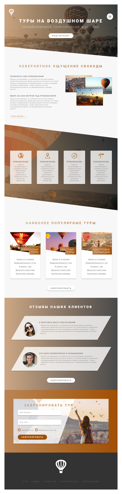

# Baloons

---



Данный лендинг разрабатывался на одном из прошедших мной курсов на образовательной платформе Stepik.

## Используемые технологии
Сайт написан на __HTML__ и __CSS__ с использованием препроцессора __SASS__.

Была разработана собственная сетка (**src/sass/layout/_grid.sass**) с помощью __float__. Это было сделано для того, чтобы продемонстрировать, что я имею представление, как работать с данной технологией. Конечно же, с помощью __Flexbox__ или __Grid__ создать этот лендинг было бы проще.

* Строчки
```sass
.row
    max-width: $grid-width
    margin: 0 auto
    &:not(:last-child)
        margin-bottom: $margin-vertical-big
        @include respond(tab-port)
            margin-bottom: 4rem
    @include clearfix
    @include respond(tab-land)
        max-width: 90.1rem
    @include respond(tab-port)
        max-width: 60rem
```
* Колонки
```sass
.col-1-of-2
    width: calc((100% - #{$gutter-horizontal}) / 2)

.col-1-of-3
    width: calc((100% - 2 * #{$gutter-horizontal}) / 3)
    @include respond(tab-land)
        width: calc((100% - 2 * #{2rem}) / 3)

.col-2-of-3
    width: calc(2 * ((100% - 2 * #{$gutter-horizontal})) / 3 + #{$gutter-horizontal})

.col-1-of-4
    width: calc((100% - 3 * #{$gutter-horizontal}) / 4)
    @include respond(tab-land)
        width: calc((100% - 3 * #{2rem}) / 4)

.col-2-of-4
    width: calc(2 * ((100% - 3 * #{$gutter-horizontal})) / 4 + #{$gutter-horizontal})

.col-3-of-4
    width: calc(3 * ((100% - 3 * #{$gutter-horizontal})) / 4 + 2 * #{$gutter-horizontal})


[class^="col-"]
    float: left
    &:not(:last-child)
        margin-right: $gutter-horizontal
    @include respond(tab-land)
        &:not(:last-child)
            margin-right: 2rem
    @include respond(tab-port)
        width: 100%
        margin-right: 0 !important
        margin-bottom: 4rem
```
В миксине clearfix использовался __float__ для построения сетки:
```sass
@mixin clearfix
    &::after
        content: ""
        display: table
        clear: both
```
Для сборки проекта использовался Gulp. Ознакомиться со сборкой Gulp, которую я использую в своих проектах - можно [здесь](https://github.com/StolbunN/GULP-Starter).

## Возможные изменения

В дальнейшем планируется доработать лендинг, а именно переделать анимацию с использованием __JavaScript__.